# Dokku with K3S Cluster in LXC on Proxmox

## What is Dokku and Why Use It?

Dokku is an open-source platform-as-a-service (PaaS) that allows you to deploy, manage, and scale applications on your own server. It’s often described as a mini-Heroku because it offers a similar workflow and feature set, but with more control and customization.

### Reasons to Use Dokku

1. **Cost-Effective**: Dokku is free and can be deployed on inexpensive virtual private servers (VPS), making it a cost-effective alternative to commercial PaaS solutions like Heroku.
2. **Control and Flexibility**: Running Dokku on your own infrastructure gives you complete control over your environment, including customization and optimization.
3. **Familiar Workflow**: If you’re familiar with Heroku, Dokku’s Git-based deployment workflow will be easy to adopt.
4. **Self-Hosting**: By using Dokku, you avoid vendor lock-in and have the flexibility to host your applications wherever you choose.
5. **Learning and Experimentation**: Dokku is great for learning about Docker, containerization, and server management.
6. **Community and Support**: Dokku has an active community and good documentation, making it easier to find help and resources when needed.

## What is Proxmox and Why Use It?

Proxmox is an open-source virtualization management solution that enables you to manage virtual machines (VMs), containers, and storage on a single platform. It simplifies the management of virtualized environments and offers a range of features for both enterprise and home use.

### Reasons to Use Proxmox

1. **Cost-Effective**: Proxmox is free to use, making it a cost-effective alternative to commercial virtualization solutions like VMware vSphere or Microsoft Hyper-V.
2. **Comprehensive Solution**: Proxmox combines virtualization, containerization, storage management, and networking in a single platform.
3. **Flexibility and Scalability**: Proxmox supports both VMs and containers, making it suitable for various environments.
4. **High Availability and Reliability**: Proxmox’s high availability features and live migration capabilities help ensure service continuity.
5. **Community and Support**: Proxmox has a strong community and commercial support options.
6. **Performance and Efficiency**: Proxmox’s use of KVM and LXC ensures high performance and efficient resource utilization.
7. **Open-Source and Transparent**: Being open-source, Proxmox offers transparency, security, and customization.
8. **Ease of Use**: The web-based management interface and comprehensive feature set make Proxmox easy to use.

## Why K3S?

K3S is a lightweight, production-grade Kubernetes distribution that simplifies the setup process by coming pre-configured with DNS, networking, and other tools out of the box. It also makes it easy to join new workers to the cluster, making it an excellent choice for smaller deployments.

## Why K3S Cluster in LXC Containers?

LXC containers are fast, almost as fast as bare metal. They are virtualized at the kernel level, making them lighter than traditional VMs. LXC containers boot nearly instantly, run at nearly the same speed as the host kernel, and are easier to reconfigure. They also require less disk space, making them easier to migrate.

## Prerequisites

Before starting, ensure you have:

1. A Proxmox server up and running.
2. A container template available on Proxmox.
3. An NFS file server for storage.

This setup assumes you’ll give your containers a small amount of disk space, with Kubernetes pods using NFS mounts for volumes.

## Installation Steps

Now that we have a clear understanding of the prerequisites, let's dive into the steps to set up your Dokku server with a K3S cluster.

### Create Base Unprivileged Container

Since our LXC containers need to run Docker containers, we need to configure them properly. We’ll create a single container and use it as a template.

1. In the Proxmox UI, click **Create CT** and check the box to show advanced settings.

    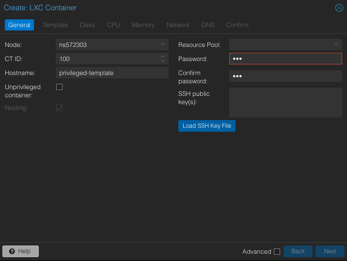

2. Fill in the container details and uncheck the **Unprivileged container** checkbox. Select your template (e.g., Debian 12). It will be the best if it will use the same OS version proxmox is using.

    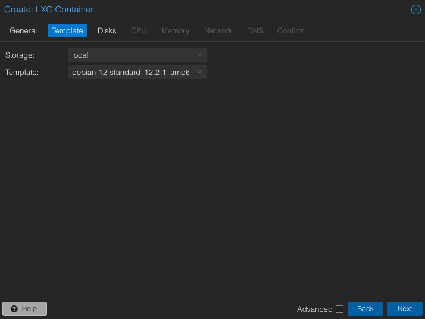

3. Choose a storage size (at least 20GB recommended).

    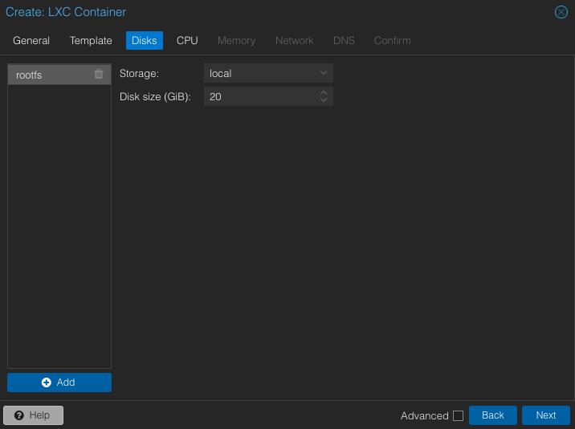

4. Select CPU cores (enough for a few more nodes).

    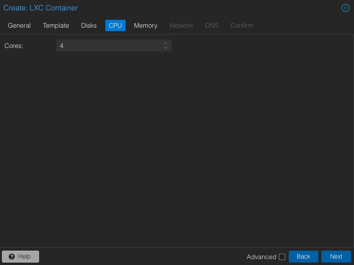

5. Choose an appropriate RAM size.

    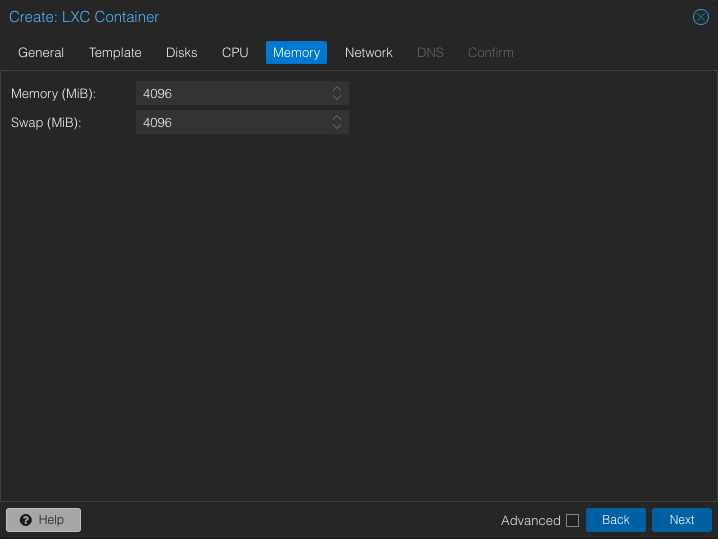

6. Configure network settings. You’ll need both an external IP and an internal network. Uncheck **firewall** for the internal network.

    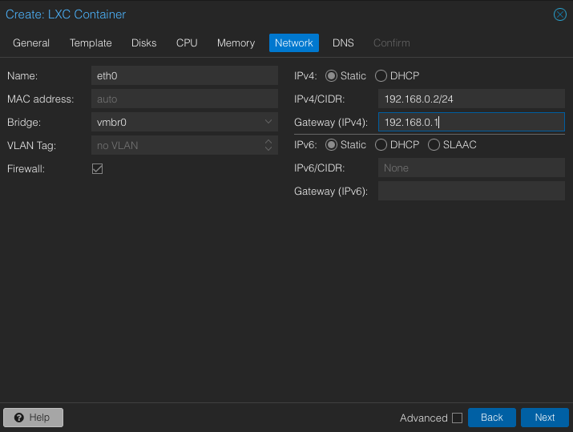

7. Set DNS settings.

    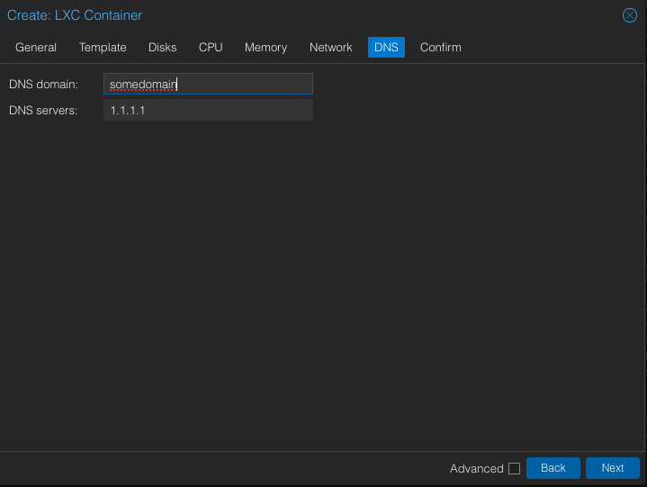

    It is better to leave the DNS domain entry empty unless it is configured to point to your server. Otherwise, it can cause TLS/SSL handshake issues for outbound traffic from the k3s pods.

9. Review your container settings and click **Finish**.

    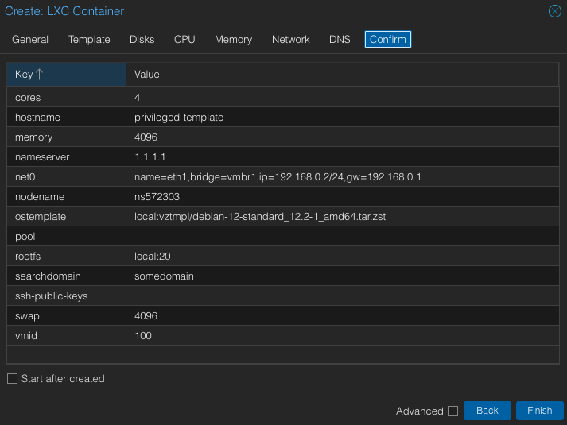

### Adjust Container Configuration

Next, we'll adjust the configuration of our container to ensure it has the necessary permissions to run Docker containers.
SSH into your Proxmox host as the root user to run these commands.

#### 1. Stop the Container

Stop the container using:
```sh
pct stop XXX
```

Edit the container’s configuration file (`/etc/pve/lxc/XXX.conf`), adding the following lines:
```sh
lxc.apparmor.profile: unconfined
lxc.cgroup.devices.allow: a
lxc.cap.drop:
lxc.mount.auto: "proc:rw sys:rw"
```

#### 2. Add `/dev/kmsg` in the Container

Create `/usr/local/bin/conf-kmsg.sh`:
```sh
#!/bin/sh -e
if [ ! -e /dev/kmsg ]; then
    ln -s /dev/console /dev/kmsg
fi
mount --make-rshared /
```

Create `/etc/systemd/system/conf-kmsg.service`:
```sh
[Unit]
Description=Make sure /dev/kmsg exists

[Service]
Type=simple
RemainAfterExit=yes
ExecStart=/usr/local/bin/conf-kmsg.sh
TimeoutStartSec=0

[Install]
WantedBy=default.target
```

Enable the service:
```sh
chmod +x /usr/local/bin/conf-kmsg.sh
systemctl daemon-reload
systemctl enable --now conf-kmsg
```

### 3. Copy modules from the host to the container
By default container does not have any modules required for the k3s functionality, let’s ensure the container has all necessary modules by copying them from the host.

1. Archive the modules:
```sh
tar -czf /tmp/modules.tar.gz -C /lib/modules/$(uname -r) .
```

2. Transfer the archive to the container:
```sh
pct push XXX /tmp/modules.tar.gz /root/modules.tar.gz
```

3. Extract the modules in the container:
```sh
mkdir -p /lib/modules/$(uname -r)
tar -xzf /root/modules.tar.gz -C /lib/modules/$(uname -r)
```

### 4. Install Additional packages
To ensure Dokku and other tools work properly, install the necessary packages.

1. Update the apt repository:
```sh
apt-get update
```

2. Install `sudo`, because dokku will need it, `curl` which is generally useful and `net-tools` that contain commands like `ifconfig`.
```sh
apt-get install sudo curl net-tools
```

### Convert Container to Template

Once the container is set up, convert it to a template for easy replication.

1. **Convert the container to a template in Proxmox:**

    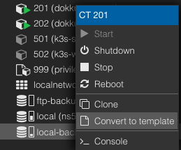

### Create Dokku Server Container from Template

Now, we'll create a Dokku server container from the template.

1. **Clone the template and adjust network settings:**

    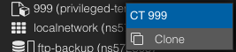

2. **Start the container:**

    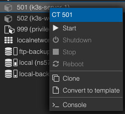

### Create Dokku User

For security, we'll create a non-root Dokku user with sudo privileges.

1. **Create a Dokku user:**
    ```sh
    adduser dokku
    adduser dokku sudo
    ```

2. **Switch to the Dokku user:**
    ```sh
    su dokku
    cd /home/dokku
    ```

### Generate public SSH key (MacOS, Linux)

1. **Open Terminal**:

2. **Generate SSH Key**: In the Terminal window, type the following command and press Enter:

    ```sh
    ssh-keygen -t rsa -b 4096 -C "your_email@example.com"
    ```

    Replace `"your_email@example.com"` with your actual email address. This command creates a new SSH key using the RSA algorithm with a 4096-bit key.

3. **Save the Key**: You will be prompted to enter a file in which to save the key. Press Enter to accept the default location (`/Users/your_username/.ssh/id_rsa`).

    ```sh
    Enter file in which to save the key (/Users/your_username/.ssh/id_rsa):
    ```

4. **Enter Passphrase**: You will be asked to enter a passphrase for the key. This is optional but recommended. Type a passphrase and press Enter, or press Enter twice to skip setting a passphrase.

    ```sh
    Enter passphrase (empty for no passphrase):
    Enter same passphrase again:
    ```

5. **Locate Your Public Key**: Your public key will be saved in the `.ssh` directory within your home directory. You can display the key using the following command:

    ```sh
    cat ~/.ssh/id_rsa.pub
    ```
    
Copy your public ssh key as we will need it during the installation.

### Dokku Installation 

Next, we'll install Dokku on the server, by following directions from https://dokku.com/

1. **Download the installation script:**
    ```sh
    wget -NP . https://dokku.com/bootstrap.sh
    ```

2. **Run the installer:**
    ```sh
    sudo DOKKU_TAG=v0.34.4 bash bootstrap.sh
    ```

3. **Configure your server domain:**
    ```sh
    dokku domains:set-global $YOUR_DOMAIN
    ```

4. **Add your public SSH key to Dokku:**
    ```sh
    echo "your-public-key-contents-here" | sudo dokku ssh-keys:add admin 
    ```

### Dokku K3S Managed Cluster Installation

Now let's set up our Dokku server to use a managed K3S scheduler for a multi-node cluster, by following directions from https://dokku.com/tutorials/other/deploying-to-k3s/

1. **Initialize as a multi-node cluster:**
    ```sh
    sudo dokku scheduler-k3s:initialize --taint-scheduling
    ```

2. **Configure Docker registry credentials:**
    ```sh
    dokku registry:login hub.docker.com $USERNAME $PASSWORD
    ```
    
3. **Set the correct server registry:**
    ```sh
    dokku registry:set --global server hub.docker.com
    ```
    
4. **Set a custom repository name:**
    ```sh
    dokku registry:set --global image-repo-template "$USERNAME/{{ .AppName }}"
    ```

5. **Set to push images on the release phase:**
    ```sh
    dokku registry:set --global push-on-release true
    ```

6. **Determine the network interface used for your private network:**
    ```sh
    sudo ifconfig
    ```

7. **Set the correct network device for K3S (e.g., `eth1`):**
    ```sh
    dokku scheduler-k3s:set --global network-interface eth1
    ```

8. **Set the proxy plugin to K3S:**
    ```sh
    dokku proxy:set --global k3s
    ```

9. **Stop any other proxy implementations (e.g., NGINX):**
    ```sh
    dokku nginx:stop
    ```

10. **Set the scheduler to K3S:**
    ```sh
    dokku scheduler:set --global selected k3s
    ```
    
At this point, all app deploys will be performed against the k3s cluster.


### Generate Public SSH Key to Connect k3s worker to the dokku k3s cluster

Dokku connects to remote servers via the root user using the Dokku user's SSH key pair. Dokku servers may not have an SSH key pair by default, but they can be generated as needed using the `git:generate-deploy-key` command on the Dokku K3S server.
```sh
dokku git:generate-deploy-key
```

This key can then be displayed with the `git:public-key` command and added to the remote server's `/root/.ssh/authorized_keys` file.
```sh
dokku git:public-key
```

### Create K3S Worker Node Container

In the Proxmox left menu, right-click on the template and choose `Clone`.


Adjust the network settings to match your needs, and we are ready to start.

Right-click on the container and select `Start`.


### Add Server's Public SSH Key to the Worker

1. Log in to the newly created worker container as root.
2. Add public SSH key that you've acquired from the K3S server with `dokku git:public-key` to the worker node:
    ```sh
    echo "your-server-public-key-contents-here" >> ~/.ssh/authorized_keys
    ```
4. Edit `/etc/ssh/sshd_config` by finding:
    ```
    #AuthorizedKeysFile     .ssh/authorized_keys .ssh/authorized_keys2
    ```
   Uncomment it and save the file:
    ```
    AuthorizedKeysFile     .ssh/authorized_keys .ssh/authorized_keys2
    ```
5. Restart the sshd service:
    ```sh
    systemctl restart sshd
    ```

### Connect Worker to the K3S Cluster

Back on the Dokku K3S server node, run the following command:
```sh
dokku scheduler-k3s:cluster-add --insecure-allow-unknown-hosts --role worker ssh://root@192.168.0.22
```
where `192.168.0.22` is the IP of the worker we have just created.

After it finishes running, you might want to verify that K3S can see the new worker node:
```sh
kubectl get nodes
```
You should see output similar to this:
```
NAME                          STATUS   ROLES                       AGE   VERSION
ip-111-111-11-11-c75c09f513   Ready    control-plane,etcd,master   38m   v1.29.5+k3s1
ip-192-168-0-22-ec81ec1f99    Ready    worker                      16s   v1.29.5+k3s1
```

### Add More Workers

For better resilience, it is recommended to have a few more worker nodes. Simply repeat the steps above.

## Use Cloudflare to Provide Secure Wildcard Access to All Your Apps

1. Add an A entry that points the main domain you are going to use to your Dokku K3S server.
2. Create a CNAME `*` that points to `yourdomain.com`.

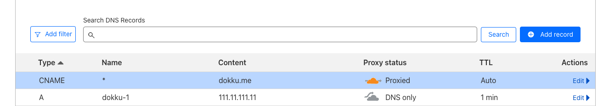

Using Cloudflare not only provides easy DNS configuration but also protects your server from DDoS attacks and allows you to take advantage of various caching services that can further speed up your application.

With this setup, all your apps will work out of the box and have HTTPS.

## Deploy App from macOS

We assume that you have `homebrew` installed on macOS. If you don't, follow the steps from: [https://brew.sh/](https://brew.sh/)

First, install `dokku` on macOS. It can be found at [https://github.com/dokku/homebrew-repo](https://github.com/dokku/homebrew-repo)

Run the following command:
```sh
brew install dokku/repo/dokku
```

Now, we are going to deploy a sample Node.js app designed to run on Heroku to our Dokku K3S cluster:
[https://github.com/heroku/node-js-getting-started](https://github.com/heroku/node-js-getting-started)

1. **Clone it to your work directory:**
    ```sh
    git clone https://github.com/heroku/node-js-getting-started.git
    ```

2. **Navigate to the new folder:**
    ```sh
    cd node-js-getting-started
    ```

3. **Create an app in Dokku:**
    ```sh
    DOKKU_HOST=dokku.me dokku apps:create node-js-getting-started
    ```
    You will see something like:
    ```
    -----> Dokku remote added at dokku-1.nullex.net called dokku
    -----> Application name is node-js-getting-started
    -----> Creating node-js-getting-started...
    -----> Creating new app virtual host file...
    ```

4. **Deploy it by running the following command:**
    ```sh
    git push dokku main
    ```

    You will see:
    ```
    -----> Running post-deploy
    -----> Checking for postdeploy task
           No postdeploy task found, skipping
    =====> Application deployed:
           http://node-js-getting-started.nullex.net
    ```

## Add Let's Encrypt

Optionally, you can protect your applications by installing the Let's Encrypt plugin and adding HTTPS to your apps. This won't be required with the Cloudflare configuration described above.

```sh
sudo dokku plugin:install https://github.com/dokku/dokku-letsencrypt.git
```

```sh
dokku letsencrypt:set node-js-getting-started email your@email.com
```

```sh
dokku letsencrypt:enable node-js-getting-started
```

## Troubleshooting

1. **Check Systemctl Status of K3S**

    To check the status of the K3S service using systemctl:
    ```sh
    sudo systemctl status k3s
    ```

2. **Check Node Status**

    Ensure your nodes are ready and not under any pressure:
    ```sh
    kubectl get nodes
    kubectl describe node <node-name>
    ```

3. **Verify Pod Status**

    Ensure all critical pods are running and not evicted:
    ```sh
    kubectl get pods -A
    kubectl describe pod <pod-name> -n <namespace>
    ```

4. **Check Services and Endpoints**

    Verify that services have valid cluster IPs and endpoints are correctly assigned:
    ```sh
    kubectl get services -A
    kubectl get endpoints -A
    ```

5. **Review System Logs**

    Check the system logs for any critical errors or warnings:
    ```sh
    sudo journalctl -u k3s
    ```

6. **Inspect Disk and Memory Pressure**

    Ensure there is no disk or memory pressure:
    ```sh
    kubectl describe node <node-name>
    ```

7. **Low Disk Space**
    Low disk space can cause the following error:
    ```sh
    /home/dokku/.basher/bash: line 1: main: command not found
     !     /home/dokku/.basher/bash: line 1: main: command not found
    ```

    This error occurs because Docker retains images that consume more space over time.

    To resolve this issue, prune Docker by running:
    ```sh
    docker system prune -a
    ```

8. **TLS/SSL Handshake Errors for Outbound Traffic from k3s Pods**
    These errors can be caused by the presence of the `option ndots:5` in /etc/resolv.conf of the pods.\
    To resolve this issue, the easiest solution is to remove the DNS domain from the settings of the LXC container.

## Helpful Resources

- The following article was the main source of the information and instructions here were just reworked for the specific Dokku use case, so check it out: [https://betterprogramming.pub/rancher-k3s-kubernetes-on-proxmox-containers-2228100e2d13](https://betterprogramming.pub/rancher-k3s-kubernetes-on-proxmox-containers-2228100e2d13)
- An excellent YouTube video that guides you through the basic Dokku setup: [https://www.youtube.com/watch?v=KMPKw5VS9pI](https://www.youtube.com/watch?v=KMPKw5VS9pI)
- Another useful README file that explains how to set up K3S in Proxmox: [https://gist.github.com/triangletodd/02f595cd4c0dc9aac5f7763ca2264185](https://gist.github.com/triangletodd/02f595cd4c0dc9aac5f7763ca2264185)
